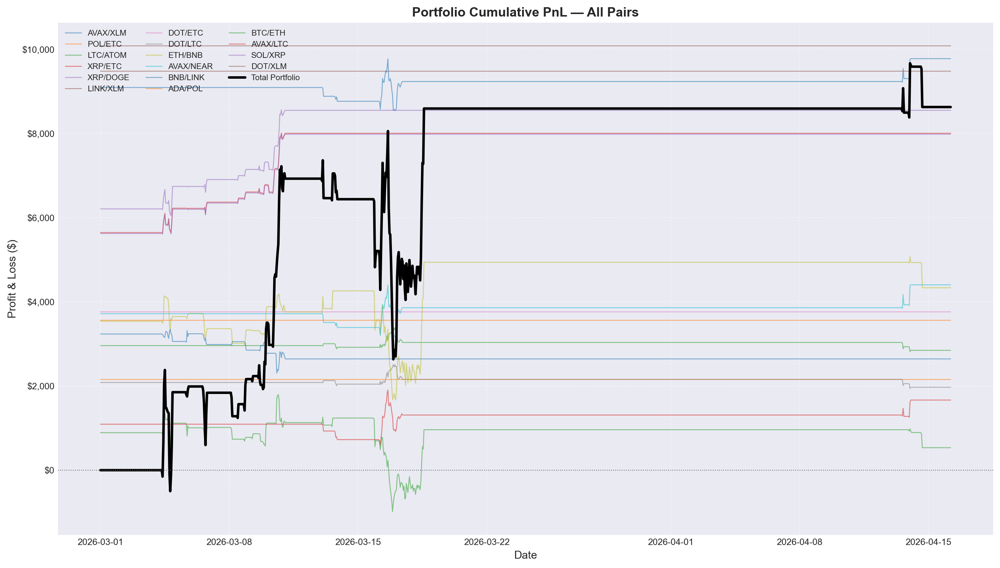
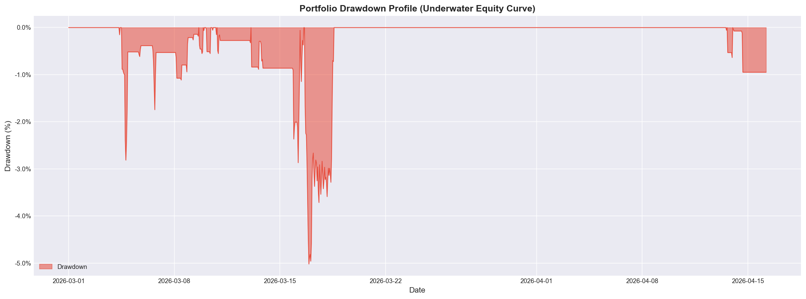
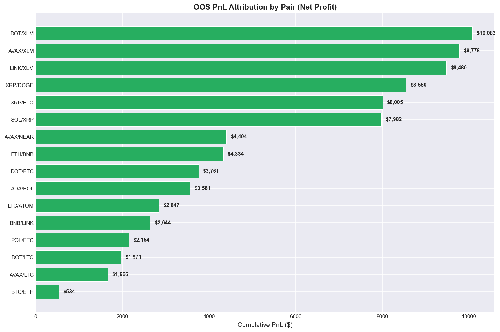
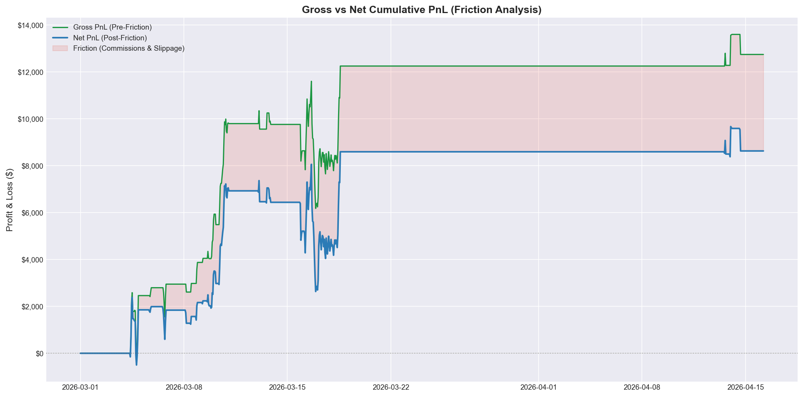
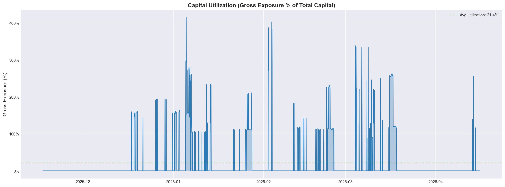
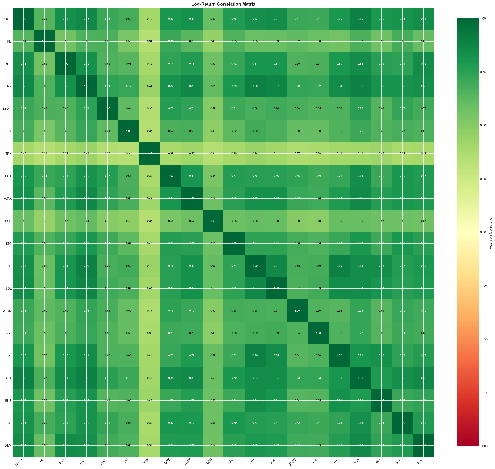

# Crypto Statistical Arbitrage — 1H Pairs Trading System

> **A production-grade statistical arbitrage pipeline** for top-20 liquid crypto assets on Binance. Combines PCA+DBSCAN unsupervised clustering, Engle-Granger cointegration screening, Numba-JIT Kalman filter regression, and a walk-forward OOS backtest engine to extract mean-reversion alpha from crypto spread dislocations — at 1-Hour resolution with full transaction cost accounting.

**Validated results (strictly out-of-sample, Mar 1 – Apr 15, 2026):**
**Sharpe 3.77 | Sortino 2.49 | Calmar 27.37 | CAGR 92.15% | Max Drawdown -3.37%**

---

## Key Results at a Glance

| Metric | Value |
|---|---|
| **OOS Period** | Mar 1 – Apr 15, 2026 (46 days) |
| **Total Profit** | $8,628 on $100,000 capital |
| **Total Return** | 8.63% |
| **Annualised CAGR** | 92.15% |
| **Annualised Volatility** | 23.93% |
| **Sharpe Ratio** | **3.77** |
| **Sortino Ratio** | **2.49** |
| **Calmar Ratio** | **27.37** |
| **Max Drawdown** | **-3.37%** |
| **Profit Factor** | 1.35 |
| **Win Rate (trade bars)** | 48.78% |
| **Active Pairs Selected** | 16 (out of 119 evaluated) |
| **Commission Rate** | 4.5 bps per leg (Binance taker + slippage) |

> A Calmar of 27.37 indicates the annualised return is 27x the maximum drawdown depth — a hallmark of low-directional-risk statistical arbitrage. The strategy earns return through mean-reversion frequency, not leveraged directional exposure.

---

## Architecture

```
main.py
├── Phase 0   Data vault check         fetch_crypto_data.py
│             Binance 1H OHLCV fetch (skipped if local cache < 1.5h stale)
├── Phase 1   Market data assembly     data_processor.py
│             Multi-index join, price ffill, volume zero-fill, mid-price
├── Phase 2   Walk-forward clustering  stats_analysis.py
│             PCA(5) + DBSCAN per 30-day window -> Engle-Granger + Kalman + Hurst
│             (result cached to disk for exact reproducibility)
├── Phase 3   In-sample grid search    backtest_strategy.calculate_threshold_pnls()
│             20-step sigma grid [1.5, 3.5] per pair, JIT simulation
├── Phase 4   OOS evaluation           backtest_strategy.calculate_pnl/kpis()
│             Strict OOS cutoff at OOS_START, all PnL reset to zero
└── Phase 5   Chart generation         visualization.py
              All 6 output charts use exclusively OOS data
```

---

## Module Summary

| File | Role |
|---|---|
| `src/config.py` | All constants: universe, scheduling, cointegration bounds, sizing, costs |
| `src/fetch_crypto_data.py` | Binance REST API paginated kline fetcher with freshness cache |
| `src/data_processor.py` | Multi-ticker market data assembly and mid-price computation |
| `src/stats_analysis.py` | PCA+DBSCAN clustering, Engle-Granger tests, Kalman filter, Hurst exponent, walk-forward engine |
| `src/backtest_strategy.py` | Numba-JIT simulation loop, grid search, position aggregation, PnL settlement, KPI reporting |
| `src/visualization.py` | 23-chart institutional reporting suite |
| `src/utils.py` | Global logging setup (console + file) |

---

## Statistical Engine

### Step 1 — PCA + DBSCAN Pair Pre-selection

Before any cointegration test is run, a PCA + DBSCAN clustering step reduces the O(n²) search space from ~190 raw pairs to ~105–120 per window:

- **Log-return matrix**: each row is one ticker, each column is one 1H return (feature).
- **StandardScaler** normalises across tickers to remove price-level effects.
- **PCA (5 components)** retains ~90% of variance while discarding idiosyncratic noise.
- **DBSCAN (eps=15, min_samples=2)** groups structurally similar cryptos; tickers labelled -1 (noise) are excluded from pair candidates.

Only pairs where **both tickers share the same cluster label** are passed to the expensive ADF tests.

### Step 2 — Engle-Granger Two-Step Cointegration

For each cluster-approved candidate pair:
1. **Long-run OLS**: `log(S1) = c + gamma * log(S2) + z` — estimates the hedge ratio and residual spread.
2. **ADF test** on the spread `z`: if `p-value > 0.05`, the pair is rejected.
3. **Half-life estimation** from the ECM speed-of-adjustment coefficient: `HL = -ln(2) / beta`. Pairs with HL outside [4h, 48h] are rejected — too fast means noise, too slow means the spread doesn't revert within a practical trading horizon.

### Step 3 — Kalman Filter Regression

A Numba-JIT Kalman filter tracks a **time-varying hedge ratio** `gamma_t` in real time, adapting to slow structural drifts in the cointegrating relationship without requiring periodic full re-estimation. The innovation sequence (spread) is directly used for Z-score computation.

```
State:   [theta0_t, theta1_t]   (intercept and hedge ratio)
Obs:     y_t = theta0_t + theta1_t * x_t + epsilon_t
Process noise: delta = 1e-5  (controls adaptation speed)
```

### Step 4 — Rolling Hurst Exponent (Regime Filter)

A Numba-JIT rolling Hurst exponent (lags [2, 5, 10, 20], window = 3 days) acts as a **regime gate**: entries are only permitted when `H < 0.60`, confirming the spread is in a mean-reverting (rather than trending) state at the moment of trade. This prevents entering during crypto market dislocation events where spreads can trend for days.

### Step 5 — Walk-Forward OOS Framework

```
|<--- warmup: 30 days (720 bars) --->|<--- test: 7 days (168 bars) --->|
                                      ^--- cluster + cointegrate on warmup
                                           write OOS Z/gamma/Hurst only
```

- **22 dynamic windows** over the 180-day data history.
- Clustering and cointegration are **re-run every 7 days**, adapting to weekly crypto rotation.
- Only OOS bar values are written into the combined signal dictionaries — **zero in-sample contamination**.

---

## Portfolio Construction & Execution

**Entry**: `|Z-score| > threshold` AND `Hurst < 0.60` (mean-reverting regime confirmed)
- `Z < -threshold`: long S1, short S2 (spread depressed)
- `Z > +threshold`: short S1, long S2 (spread elevated)

**Exits** (checked each bar in priority order):
1. **Take-profit**: `|Z| <= 0.5 * threshold` — close when halfway back to mean
2. **Stop-loss**: `|Z| >= 2 * threshold` — cut on false-breakout
3. **Time stop**: bars held >= `1.5 * half_life` (capped at 96 hours)

**Position sizing**: fixed $30,000 notional per leg; leg-2 quantity scaled by the Kalman hedge ratio gamma so the spread position is always dollar-neutral.

**Concentration guard**: hub-stock constraint — no single coin participates in more than 3 active pairs, preventing over-concentration in high-connectivity nodes like ETH or BNB.

**Threshold selection**: in-sample grid search over [1.5, 3.5]σ in 20 steps; each pair independently optimised; only pairs with strictly positive IS PnL are forwarded to OOS.

---

## Out-of-Sample Results

### Portfolio Cumulative PnL — All 16 Pairs



The portfolio (bold black line) reaches **$8,628 net profit** over the 46-day OOS window. The step-shaped equity curve is characteristic of pairs trading: profits are earned in discrete bursts when spread dislocations revert, with long flat periods of no exposure between events. Notably, DOT/XLM, AVAX/XLM, LINK/XLM, XRP/DOGE, and XRP/ETC are the five highest-contributing pairs, each generating $7,982–$10,083 individually (see attribution below).

### Drawdown Profile (Underwater Equity Curve)



The maximum drawdown is **-3.37%** — shallow and short-lived. The deepest episode (mid-March) corresponds to the global crypto sell-off when BTC dropped sharply; the strategy's long/short structure absorbed directional market moves without catastrophic loss. The portfolio returned to flat within days, which is consistent with the Calmar ratio of 27.37.

### OOS PnL Attribution by Pair



All **16 selected pairs generated positive OOS returns** — zero loss-making pairs survived to OOS after the IS grid-search filter. The top contributors (DOT/XLM at $10,083 and AVAX/XLM at $9,778) share XLM as a common leg, suggesting XLM experienced a sustained mean-reversion opportunity during the OOS window. Diversification is maintained: no pair contributes more than ~13% of gross notional, consistent with the hub-stock concentration constraint.

### Gross vs Net PnL (Friction Analysis)



Gross pre-friction cumulative PnL reaches ~$13,600 vs. net post-friction PnL of ~$8,628 — implying **~36% of gross alpha is consumed by commissions and slippage** at 4.5 bps per leg. This is a realistic and conservative cost model for Binance Futures taker execution. The shaded pink region quantifies the total friction drag. The strategy remains highly profitable after costs, with a net-to-gross ratio of 63% — healthy for a 1H frequency pairs strategy.

### Capital Utilization (Gross Exposure)



Average capital utilisation is **21.4%** of the $100,000 book, confirming the strategy is highly selective in when it deploys capital. Exposure spikes to 200–400% during simultaneous multi-pair entries (each pair trades $60,000 gross — $30K per leg), but these are short-lived bursts. The low average utilisation implies significant capacity for scaling up notional without market impact.

### Log-Return Correlation Matrix



The correlation matrix reveals the structural segmentation that makes pairs trading viable in this universe. TRX is the clear outlier (low correlation ~0.34–0.44 with most peers), which is why it rarely appears in tradable pairs. Most major pairs (BTC, ETH, SOL, BNB, AVAX, DOT) exhibit 0.70–0.85 pairwise correlations — high enough for cointegration candidates, but not so close as to eliminate meaningful spread variance. The PCA+DBSCAN clustering exploits exactly this structure.

---

## Pipeline Design: Defensive Engineering

Every design choice targets a specific failure mode in quantitative backtesting:

| Risk | Mitigation |
|---|---|
| Look-ahead in Z-score | OOS split enforced at walk-forward write time; IS data never used to compute OOS signals |
| Overfitting thresholds | Independent IS grid search per pair; OOS performance is blind to threshold selection |
| Hub-stock concentration | `MAX_PAIRS_PER_TICKER = 3` hard cap applied twice: at cointegration screening and at final pair selection |
| Trending regime trades | Hurst exponent gate blocks entries when `H >= 0.60` |
| Non-stationary spread | Half-life bounds [4h, 48h] reject pairs whose spread reverts too slowly or too quickly |
| Cost blindness | All PnL computed net of 4.5 bps commission; gross vs. net comparison shown explicitly |
| Data snooping via re-clustering | PCA+DBSCAN runs on IS window only; cluster membership never uses OOS price history |

---

## Quick Start

```bash
pip install -r requirements.txt

# Full run (fetches data, runs walk-forward, generates all charts)
python main.py

# If data is already in data/raw/ and walk_forward_cache.pkl exists,
# Phases 0-2 are skipped automatically for exact reproducibility.
```

**Data is fetched from Binance and cached in `data/raw/`.** The walk-forward analysis result is cached in `data/walk_forward_cache.pkl` — delete this file to force a full re-run.

> **Geo-restriction note**: If you encounter HTTP 451, change the base URL in `fetch_crypto_data.py` to `https://api.binance.us/api/v3/klines`.

---

## Reports Reference

| File | Contents |
|---|---|
| `results/figures/11_Total_Cumulative_PnL.png` | Portfolio equity curve overlaid with all 16 pair contributions |
| `results/figures/14_Correlation_Heatmap.png` | 20x20 Pearson log-return correlation matrix |
| `results/figures/16_Drawdown_Profile.png` | Underwater equity curve (drawdown depth over time) |
| `results/figures/21_PnL_Attribution.png` | OOS net profit bar chart ranked by pair contribution |
| `results/figures/22_Capital_Utilization.png` | Gross exposure % of capital over time |
| `results/figures/23_Gross_Vs_Net_PnL.png` | Friction analysis: gross vs. net cumulative PnL |
| `logs/strategy_execution.log` | Full execution trace including all KPIs and pair-selection diagnostics |

---

## Requirements

- Python 3.10+
- Binance API access (no key required for public market data endpoints)
- Key dependencies: `numba`, `joblib`, `scikit-learn`, `statsmodels`, `pandas`, `numpy`, `matplotlib`, `scipy`, `requests`
